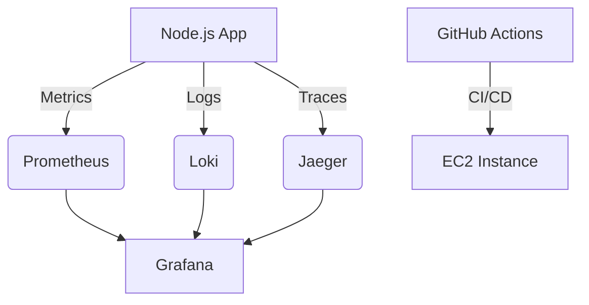

# DevOps Observability System


A complete observability stack with **Prometheus (metrics)**, **Loki (logs)**, **Jaeger (traces)**, and **Grafana (visualization)** deployed on **AWS EC2** with **GitHub Actions CI/CD**.

## 📌 Features

- **Real-time metrics collection** with Prometheus
- **Centralized logging** with Loki
- **Distributed tracing** with Jaeger
- **Beautiful dashboards** with Grafana
- **Automated CI/CD pipeline** with GitHub Actions
- **Infrastructure-as-Code** using Docker Compose
- **Sample Node.js application** for demo purposes

## 🚀 Quick Start

### Prerequisites
- AWS EC2 instance (Ubuntu 22.04 recommended)
- Docker & Docker Compose installed
- GitHub account

### Deployment Steps

1. **Clone the repository**
   ```bash
   git clone https://github.com/your-username/devops-observability-system.git
   cd devops-observability-system
   ```
2. **Configure GitHub Secrets
- SSH_PRIVATE_KEY: Your EC2 .pem key
- EC2_IP: Your EC2 public IP
- KNOWN_HOSTS: Output of ssh-keyscan <EC2_IP>

3. ** Push to GitHub (auto-deploys via GitHub Actions)
   ```bash
   git add .
   git commit -m "Initial commit"
   git push origin main
   ```
### Architecture

